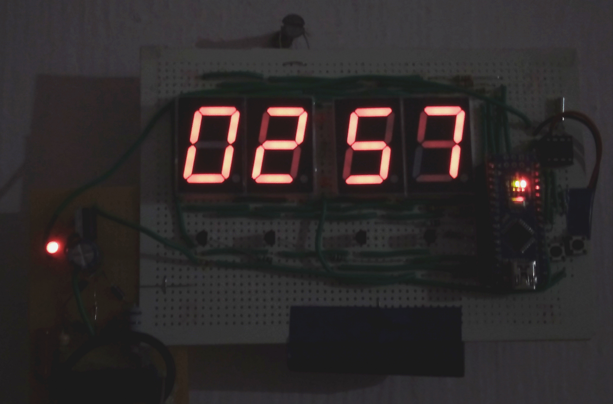
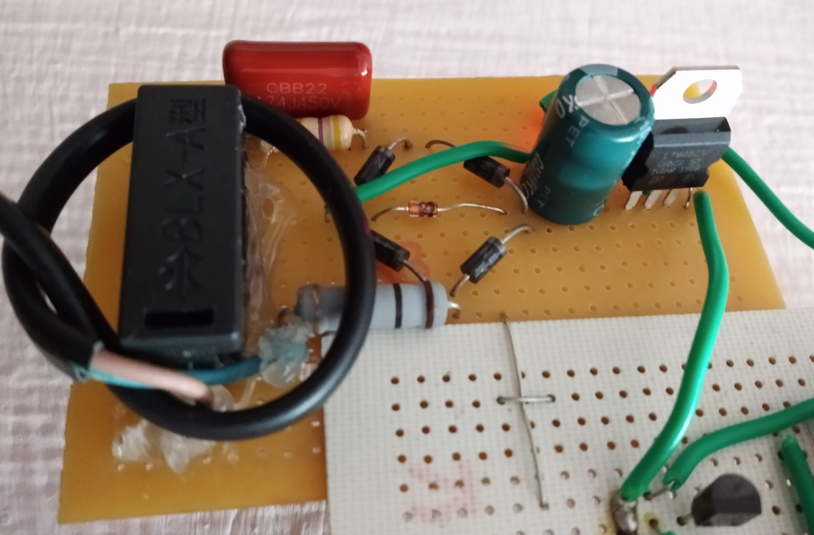

A simple digital clock made using DS1307 and Arduino Nano (in < Rs.500/-)

 

* ## <a href="https://pa1tech.github.io/DIY-Digital-Clock/schematic.pdf" target="_blank">Schematic (PDF)</a>
* ### <a href="https://pa1tech.github.io/DIY-Digital-Clock/BoM.html" target="_blank">Bill of Materials</a>

Capacitive Dropper for AC-DC conversion: 

### [Arduino Code](https://github.com/pa1tech/DIY-Digital-Clock/tree/main/Arduino%20Code)
### [Micropython for RPi Pico](https://github.com/pa1tech/DIY-Digital-Clock/blob/main/u_python%20Code%20for%20RPi%20Pico)

### References
* <a href="https://www.instructables.com/id/DIY-Digital-Clock-With-7-Segment-LED-Display/" target="_blank">DIY Digital Clock - Instructables</a>
* <a href="https://www.digikey.it/en/maker/projects/capacitive-dropper/965d2328b35e43079e4eb99cf717137f" target="_blank">Capacitive Dropper - Digikey</a>
