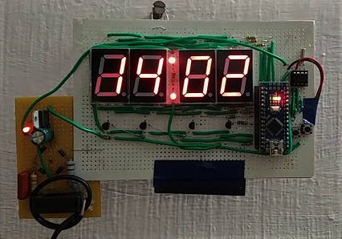

A simple digital clock made using DS1307 and Arduino Nano (in < Rs.500/-)

 

**Schematic:**

Power Supply: 

### [Arduino Code](https://github.com/pa1tech/DIY-Digital-Clock/tree/main/Arduino%20Code)

### References
* <a href="https://www.instructables.com/id/DIY-Digital-Clock-With-7-Segment-LED-Display/" target="_blank">DIY Digital Clock - Instructables</a>
* <a href="https://www.digikey.it/en/maker/projects/capacitive-dropper/965d2328b35e43079e4eb99cf717137f" target="_blank">Capacitive Dropper - Digikey</a>