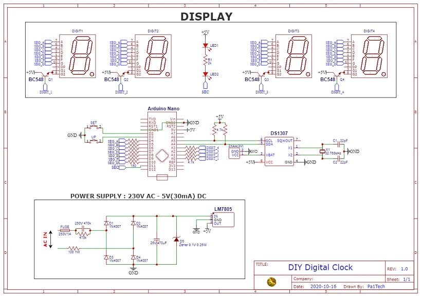

A simple digital clock made using DS1307 and Arduino Nano (in < Rs.500/-)

<figure class="video_container">
  <video muted width="320" height="180" controls="true" allowfullscreen="true">
    <source src="media/video.mp4" type="video/mp4">
  </video>
</figure>

* ## <a href="https://pa1tech.github.io/DIY-Digital-Clock/schematic.pdf" target="_blank">Schematic PDF version</a>

* ### Capacitive Dropper + Full-bridge for AC-DC conversion

	

* ### [Arduino Code](https://github.com/pa1tech/DIY-Digital-Clock/tree/main/Arduino%20Code)
* ### My GitHub repo - [DIY Digital Clock](https://github.com/pa1tech/DIY-Digital-Clock)

* ### References
	* <a href="https://www.instructables.com/id/DIY-Digital-Clock-With-7-Segment-LED-Display/" target="_blank">DIY Digital Clock - Instructables</a>
	* <a href="https://www.digikey.it/en/maker/projects/capacitive-dropper/965d2328b35e43079e4eb99cf717137f" target="_blank">Capacitive Dropper - Digikey</a>